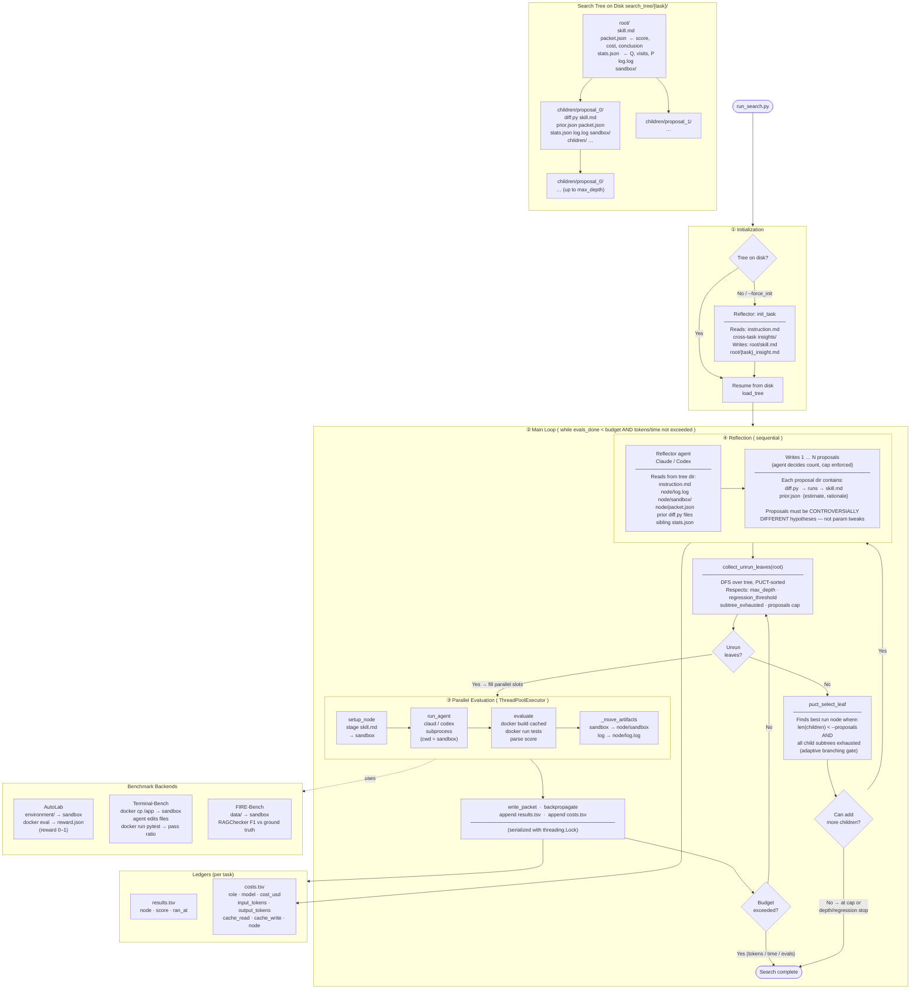
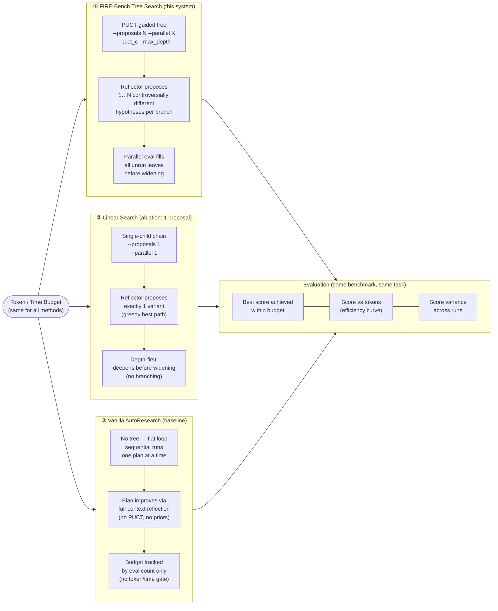
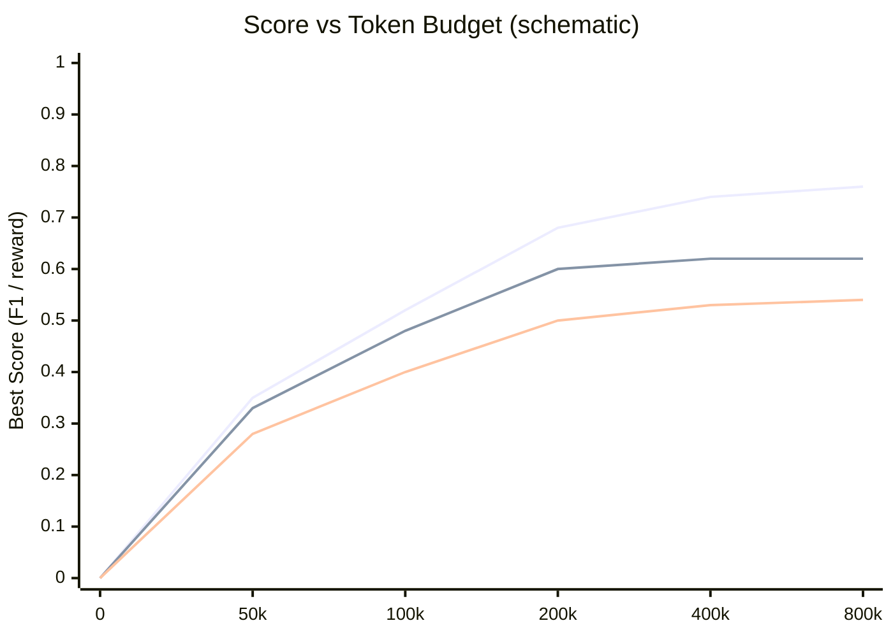
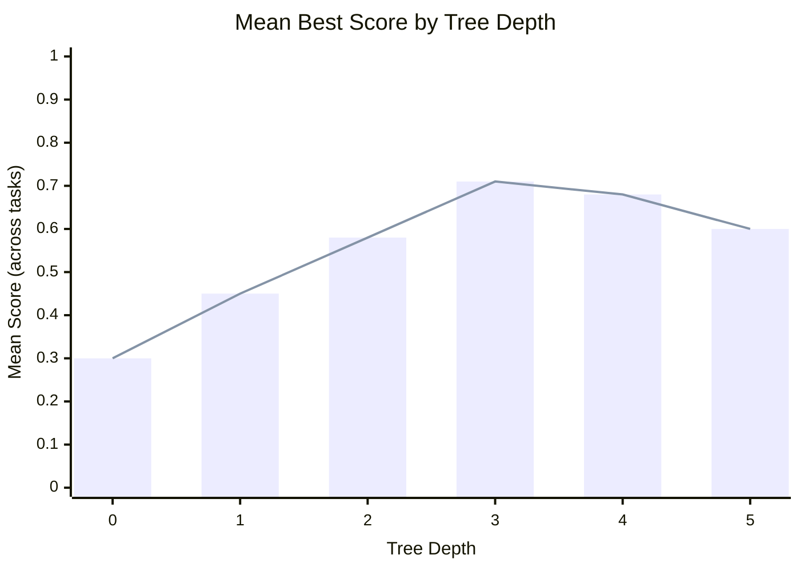

## FIRE-Bench Self-Improvement Search Pipeline

### Key design decisions

| Decision | Rationale |
|----------|-----------|
| Only add proposals after full subtree exhaustion | Never widen before the current depth is fully explored — avoids premature branching |
| Reflector decides proposal count (1 … cap) | LLM judges diversity better than a fixed formula; proposals must be *controversially different* |
| Parallel eval, sequential reflection | Agent runs are independent (separate sandboxes); reflection needs prior results |
| `costs.tsv` tracks both agent + reflector | Single file gives total token spend per task across all components |
| `--max_tokens` / `--max_time_sec` | Enables fair comparison across methods under the same resource budget |

---

## Experimental Comparison Framework

---

## Token Budget vs Score Curve  (expected shape)

> **Legend (top to bottom):** Tree Search (--proposals 2) · Linear Search (--proposals 1) · Vanilla AutoResearch
>
> Tree search should dominate once the tree has enough budget to branch — both methods are similar at very low budgets where only 1–2 evals are possible.

---

## Search Tree Depth vs Score  (observed on autolab tasks)

> Peak performance at depth 3; decline at depth 4–5 suggests overfitting of skill.md to node-specific noise.
> Motivates `--max_depth 4` and lower `--puct_c 1.0` (exploit more, explore less).
